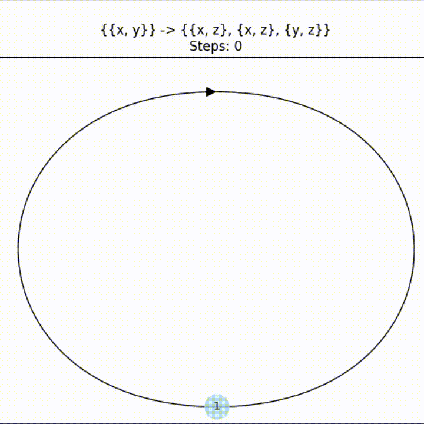

Wolfram physics project  
https://www.wolframphysics.org/technical-introduction/introduction/  
https://www.wolframphysics.org/technical-introduction/potential-relation-to-physics/potential-basic-translations/index.html  
  
runtime code generation for graph substitution  
small clone of https://github.com/maxitg/SetReplace  
networkx graph layout algorithm very slow  

  
  
